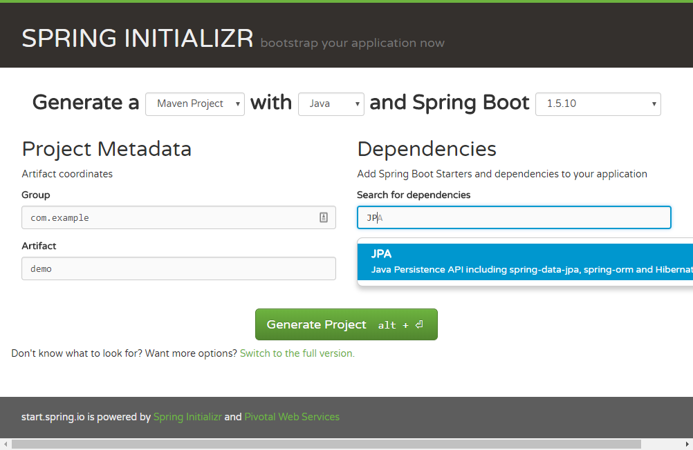

<!-- $theme: gaia -->
<!-- template : invert -->
<!-- page_number: true -->

Spring-Boot 1.5.x
===

<center>

</center>

##### Hiver 217

---

# Prérequis

- Java
- Maven
- JEE
---

# What is Spring ?

<center>

<br/>

[overview](https://docs.spring.io/spring/docs/current/spring-framework-reference/overview.html)

</center>
 
---

# What is Spring ?
 - Spring came into being in 2003
 - Spring makes it easy to create Java enterprise applications
 - support for Groovy and Kotlin
 - Spring Boot, Spring Security, Spring Data, Spring Cloud, Spring Batch ...
 - starter : [https://start.spring.io/]()
---

# Spring or Jee ?

<center>


</center>

--- 
<!-- $theme: gaia -->
<!-- template : -->
# Spring Boot : Features

 - Create stand-alone Spring applications
 - Embed Tomcat, Jetty or Undertow directly (no need to deploy WAR files)
 - Automatically configure Spring
 - Provide production-ready features such as metrics, health checks and externalized configuration
 - Absolutely no code generation and no requirement for XML

--- 

# What we need

- [jdk8](http://www.oracle.com/technetwork/java/javase/downloads/jdk8-downloads-2133151.html)
- [maven3](https://maven.apache.org/download.cgi)
- [eclipse](https://www.eclipse.org/downloads/packages/eclipse-ide-java-ee-developers/oxygen1a)
- [IntelliJ](https://www.jetbrains.com/idea/download/#section=windows)
- [git bash](https://git-for-windows.github.io/)
- try with 
 ``` git clone https://github.com/rbonnamy/exemple-spring-boot && cd exemple-spring-boot && mvn spring-boot:run ```

---
# Springboot initializer

https://start.spring.io/
<center>



</center>

---

# Springboot CLI

[Getting Started](https://docs.spring.io/spring-boot/docs/current/reference/html/getting-started-installing-spring-boot.html#getting-started-cli-example)
```
$ spring init -dweb,jpa,security —build maven
$ spring run app.groovy
```
<center>


</center>

---

# Spring build system

- maven
- gradle
- ant


---

# TP1 : Spring Boot : First Application (1)
In the ```pom.xml``` [https://projects.spring.io/spring-boot/]()

```
<parent>
    <groupId>org.springframework.boot</groupId>
    <artifactId>spring-boot-starter-parent</artifactId>
    <version>1.5.8.RELEASE</version>
</parent>
<dependencies>
    <dependency>
        <groupId>org.springframework.boot</groupId>
        <artifactId>spring-boot-starter-web</artifactId>
    </dependency>
</dependencies>
```

---

# TP1 : Spring Boot : First Application (2)

You application ```fr/todo/TodoController.java```
```
@Controller
@EnableAutoConfiguration
public class TodoController {
    @RequestMapping("/")
    @ResponseBody
    String home() {
        return "Hello World!";
    }
    public static void main(String[] args) 
    	throws Exception { 
        SpringApplication.run(TodoController.class,
        args);
    }
}
```

--- 
# TP1 : Spring Boot : First Application (3)

```
mvn spring-boot:run
```

Accédez à [http://localhost:8080]()


```
  .   ____          _            __ _ _
 /\\ / ___'_ __ _ _(_)_ __  __ _ \ \ \ \
( ( )\___ | '_ | '_| | '_ \/ _` | \ \ \ \
 \\/  ___)| |_)| | | | | || (_| |  ) ) ) )
  '  |____| .__|_| |_|_| |_\__, | / / / /
 =========|_|==============|___/=/_/_/_/
 :: Spring Boot ::        (v1.5.8.RELEASE)
```

--- 
# TP1 : Spring Boot : First Application (4)

Accédez à l'application [http://localhost:8080]()

<center>

</center>
			
--- 
# About this code
- ```@EnableAutoConfiguration```: This annotation tells Spring Boot to “guess” how you will want to configure Spring, based on the jar dependencies that you have added
-  ```@RestController```  and ```@RequestMapping``` annotations :  our class is a web ```@Controller``` so Spring will consider it when handling incoming web requests
-  ```main``` method
-  [Starters](https://docs.spring.io/spring-boot/docs/current/reference/htmlsingle/#using-boot-starter)

--- 


# Spring Beans and dependency injection

- Design pattern that implements inversion of control for resolving dependencies

<center>
	
</center>

--- 
# Spring Context : 
<center>
	
</center>
<center>
	
</center>

---

# TP2 : Structure & IOC

Create a good strucure  like that :
```
fr
 +- todo     
      +- Application.java
      |
      +- domain
      |   +- TodoModel.java
      |   +- TodoRepository.java
      |
      +- service
      |   +- TodoService.java
      |
      +- web
          +- TodoController.java
```
---

# TP2 : Structure & IOC

File : ```Application.java```
```
@SpringBootApplication
public class Application {

    public static void main(String[] args) {
        SpringApplication.run(Application.class, args);
    }

}
```
--- 

# TP2 : Structure & IOC

File ```TodoService.java```
```
@Service
public class TodoService {

    public String getTodo(){
        return "Hello World";
    }
}
```
--- 

# TP2 : Structure & IOC

Injection in the controller ```TodoController.java```

```
    @Autowired
    private TodoService todoService;

    @RequestMapping("/")
    @ResponseBody
    String todo() {
        return todoService.getTodo();
    }
```

---

# About this code

- Quid Interfaces?
- ```@Service```
- Usually the class that defines the main method is also a good candidate as the primary ```@Configuration```
- ```@ComponentScan``` to automatically pick up all Spring components
- The ```@SpringBootApplication``` annotation is equivalent to using ```@Configuration```, ```@EnableAutoConfiguration``` and ```@ComponentScan ```
--- 
# TP3 : Spring dev tools 
 - Spring Boot includes an additional set of tools that make the application development experience more pleasant
 in the ```pom.xml```
```
<dependencies>
    <dependency>
        <groupId>org.springframework.boot</groupId>
        <artifactId>spring-boot-devtools</artifactId>
        <optional>true</optional>
    </dependency>
</dependencies>

```

---

# TP3 : Hot reload
 - Active the hot reload

```
<plugin>
    <groupId>org.springframework.boot</groupId>
    <artifactId>spring-boot-maven-plugin</artifactId>
    <dependencies>
        <dependency>
            <groupId>org.springframework</groupId>
            <artifactId>springloaded</artifactId>
            <version>1.2.6.RELEASE</version>
        </dependency>
    </dependencies>
</plugin>

```

---

# TP3 : Hot reload
 - Intellij : ```ctrl``` ```alt``` ```s``` : build / compile active build project automatically
 - Intellij : ```ctrl``` ```shift``` ```a```, type registry, turn on ```compiler.automake.allow.when.app.running```
 - Intellij : run configuration add VM options :
```
-javaagent:C:/Users/{user}/.m2/repository/org/springframework/springloaded/1.2.5.RELEASE/springloaded-1.2.5.RELEASE.jar -noverify 
```
 
---

# TP3 : Propertie File

- ```application.properties ``` allow you to parametrize your spring boot application.
- This file will be placed in your class path
```
message.txt = Hello World
```
And in your ```TodoService.java ``` inject the propertie :

```
 @Value("${message.txt}")
 private String msg;
```
You also can do the configuration in ```yml```

---

# Properties

Propertie file : (support placeholder ```${var}```)
```
database.url=jdbc:postgresql:/localhost:5432/instance
database.username=foo
database.password=bar
```
consommation
```
@ConfigurationProperties(prefix = "database")
public class Database {
    String url;
    String username;
    String password;
    // standard getters and setters
}
```
---

# Profiles
Any ```@Component``` or ```@Configuration``` can be marked with ```@Profile``` to limit when it is loaded:

- In the propertie file
```spring.profiles.active=dev,hsqldb```
- In the command line
```--spring.profiles.active=dev,hsqldb```
- Profils in properties files : 
```application.propertie```
```application-dev.propertie```
```application-prod.propertie```

---

# Configuration - XML 1/2
- web.xml
```xml
<context-param>
<param-name>contextConfigLocation</param-name>
<param-value>/WEB-INF/servicesContext.xml /WEB-INF/daoContext.xml
/WEB-INF/applicationContext.xml</param-value>
</context-param>
```
---

# Configuration - XML 2/2
- application.xml
```xml
<?xml version="1.0" encoding="UTF-8"?>
<beans xmlns="http://www.springframework.org/schema/beans" 
xmlns:xsi="http://www.w3.org/2001/XMLSchema-instance" 
xsi:schemaLocation="http://www.springframework.org/schema/beans 
http://www.springframework.org/schema/beans/spring-beans-2.5.xsd">
  <bean id="..." class="...">
    <!-- configuration et description des dependances --> 
  </bean>
  <bean id="...' class="...">
    <!-- configuration et description des dependances --> 
  </bean>
</beans>
```

---

# Configuration - By class

- ```@Configuration``` : into a single class
- ```@ComponentScan``` : automatically pick up all Spring components
- ```@ImportResource``` : annotation to load XML configuration files
---

# Log Customisation
Levels : 
```
logging.level.root=WARN
logging.level.org.springframework.web=DEBUG
logging.level.org.hibernate=ERROR
```

```log4j```
- ```log4j2-spring.xml``` or ```log4j2.xml```
 
```logback```
- ```logback-spring.xml```, ```logback-spring.groovy```, ```logback.xml``` or ```logback.groovy```


---

# What is MVC
<center>

<br/>


</center>

---

# Spring MVC

- service static content in ```application.properties```
```
spring.mvc.static-path-pattern=/resources/**
```

- default template location :
```
src/main/resources/templates 
```

---

# Spring MVC - customize generics pages

- custom error pages

```
src/
 +- main/
     +- java/
     |   + <source code>
     +- resources/
         +- public/
             +- error/
             |   +- 5xx.ftl
             |   +- 404.html
             +- <other public assets>

```

--- 

# Spring MVC - servlet / filter

- Servlet : ```@WebServlet```
- Filter : ```@WebFilter```
--- 

# Spring MVC - template engine

- [FreeMarker](https://freemarker.apache.org/docs/)
- [Groovy](http://docs.groovy-lang.org/docs/next/html/documentation/template-engines.html#_the_markuptemplateengine)
- [Thymeleaf](http://www.thymeleaf.org/)
- [Mustache](https://mustache.github.io/)
- JSP limitations : servlet container web is server dependant


---

# TP 3.1 - Spring MVC


- add pom dependency

```
<dependency>
  <groupId>org.springframework.boot</groupId>
  <artifactId>spring-boot-starter-thymeleaf</artifactId>
</dependency>
```
- in controller add the following method :
```java
   @RequestMapping("/main")
    public String main(@RequestParam(value="name", required=false, defaultValue="World") String name, Model model) {
        model.addAttribute("name", name);
        return "main";
    }
```

---

# TP 3.1 - Spring MVC

 - create template in ```src/main/resources/templates/main.html```
```xml
<html xmlns:th="http://www.thymeleaf.org">
<head>
    <title>Getting Started: Serving Web Content</title>
    <meta http-equiv="Content-Type" content="text/html; charset=UTF-8" />
</head>
<body>
    <p th:text="'Hello, ' + ${name} + '!'" />
</body>
</html>
```
---
# TP 3.1 Spring MVC - Test

- Create a test using documentation : https://spring.io/guides/gs/testing-web/
- Use fragment https://dzone.com/articles/spring-boot-thymeleaf-template-decorator-using-thy
- little more with thymelead : http://www.baeldung.com/thymeleaf-in-spring-mvc 
- Validation https://spring.io/guides/gs/validating-form-input/
---

# Spring MVC : REST

- Rich model view controller web framework
- Handle incoming HTTP requests ```@RequestMapping```
- ```@RestController``` to serve JSON data

Example : 
```
@RestController
@RequestMapping(value="/users")
public class MyRestController {
    @RequestMapping(value="/{user}",
    			method=RequestMethod.GET)
    public User getUser(@PathVariable Long user) {
        // ...
    }
```

--- 

# TP 4 : Spring MVC : REST
- Create un json service REST to return a Random TodoModel instance

In the ```TodoService.java```
```
@Value("${message.txt}")
    private String msg;

     public TodoModel getTodo(String id){
        TodoModel todoModel = new TodoModel();
        todoModel.setText("id= " + id + ";" + msg);
        return todoModel;
    }

```
---
# TP 4 : Spring MVC : REST
- Configure a ```@RestController```

In the ```TodoController.java```

```

  @RequestMapping(value = "/todo/{todoId}", 
  	method = RequestMethod.GET)
    public TodoModel todo(@PathVariable String todoId) {
        return todoService.getTodo(todoId);
    }
```

- Add ```POST```, ```PUT```, ```DELETE``` to create, update or delete a TodoModel via the TodoService.
[some help](https://www.leveluplunch.com/java/tutorials/014-post-json-to-spring-rest-webservice/)

---
 # Postman to test

[Chrome cast plugin ](https://chrome.google.com/webstore/detail/postman/fhbjgbiflinjbdggehcddcbncdddomop)

<center>

</center>

---
# What is JPA
- Java Persistence API to persistently store the vast amounts of data into a database


[resources](https://www.tutorialspoint.com/jpa/index.htm)

---

# JPA - An Entity

Exemple of an Entity :
```
@Entity
@Table
public class Employee {

   @Id
   @GeneratedValue(strategy = GenerationType.AUTO) 	   
   private int eid;
   
   private String ename;
   private double salary;
   private String deg;
  }
```

---

# JPA - Use of Entity
Exemple of create an entity employe 
```
entitymanager.getTransaction( ).begin( );

      Employee employee = new Employee( ); 
      employee.setEid( 1201 );
      employee.setEname( "Gopal" );
      employee.setSalary( 40000 );
      employee.setDeg( "Technical Manager" );
      
      entitymanager.persist( employee );
      entitymanager.getTransaction( ).commit( );

      entitymanager.close( );
```

---

# JPA - JPQL

```JAVA
Query query = entitymanager.createQuery(
	"Select MAX(e.salary) from Employee e");
```

```JAVA
Query query = entitymanager.createQuery(
	"Select MAX(e.salary) from Employee e 
    	where e.salary Between 30000 and 40000");
```

```JAVA
@NamedQuery(query = 
	"Select e from Employee e 
    	where e.eid = :id", name = "find employee by id")
        
Query query = entitymanager
	.createNamedQuery("find employee by id");
```

---

# JPA - JPQL

### Eager fetch
Fetching the whole record while finding the record using Primary Key.

### Lazy fetch
Lazy fetch is possible when you try to fetch the record for the first time. Performance wise, lazy fetch is preferable.

--- 


# JPA - Criteria

```
EntityManager em = ...;
CriteriaBuilder cb = em.getCriteriaBuilder();

CriteriaQuery<Entity class> cq =
			cb.createQuery(Entity.class);
Root<Entity> from = cq.from(Entity.class);

cq.select(Entity);
TypedQuery<Entity> q = em.createQuery(cq);
List<Entity> allitems = q.getResultList();
```

---

# JPA - Collections
Relations : ```@ManyToOne```, ```@OneToMany```,```@OneToOne```,```@ManyToMany```
<center>


</center>

[More information](https://www.tutorialspoint.com/jpa/jpa_entity_relationships.htm)

---
# Spring Data

- Create repositories that use the Java Persistence API
- Easy Spring integration 
- Multiple database support

[exemples](http://projects.spring.io/spring-data/)
[reference](https://docs.spring.io/spring-data/jpa/docs/current/reference/html/)


---

# TP5 : Spring Data

H2 embedded with the ```application.properties```

```
spring.h2.console.enabled=true
spring.h2.console.path=/h2
spring.jpa.hibernate.ddl-auto=create-drop
```
File ```pom.xml```
```
<dependency>
    <groupId>org.springframework.boot</groupId>
    <artifactId>spring-boot-starter-data-jpa</artifactId>
</dependency>
<dependency>
    <groupId>com.h2database</groupId>
    <artifactId>h2</artifactId>
</dependency>
```
---

# TP5 : Spring Data 

Connect with your browser [http://localhost:8080/h2]() at ```jdbc:h2:mem:testdb``` JDBC Url

<center>

</center>

---

# TP5 : Spring Data JPA

Create your first entity ```TodoModel```: 

```JAVA
 @Id @GeneratedValue(strategy=GenerationType.AUTO) 
 private long id;
 ```
 or
 ```JAVA
@Id @GeneratedValue(generator="uuid")
@GenericGenerator(name = "uuid", strategy = "uuid2")
private String id;
 ```
 Try it with your ```H2``` console and your ```postman tools```


---

# TP5 Spring Data JPA

Create your repository

```JAVA
public interface TodoRepository 
	extends CrudRepository<TodoModel, String> {
}

```
Show your ```TodoRepository``` interface

```
@NoRepositoryBean
public interface CrudRepository<T, ID extends Serializable> extends Repository<T, ID> {
    <S extends T> S save(S var1);
    <S extends T> Iterable<S> save(Iterable<S> var1);
...

```
---

# TP5 Spring Data JPA

- Use the repository for CRUD with the ```TodoService```
- Create a query to count by todo = TRUE [(help)](https://docs.spring.io/spring-data/jpa/docs/current/reference/html/#repositories)
- Add list REST access
```
@Autowired
private TodoRepository todoRepository;
```
<center>

</center>

---

# Spring Data Repositories

Server pagination
```JAVA
public interface PagingAndSortingRepository<T, ID>
  extends CrudRepository<T, ID> {

  Iterable<T> findAll(Sort sort);

  Page<T> findAll(Pageable pageable);
}
```
Usage
```JAVA 
Page<User> users = repository
	.findAll(new PageRequest(1, 20));
```
---

# Spring Data queries 
[Definitions](https://docs.spring.io/spring-data/jpa/docs/current/reference/html/#jpa.query-methods.query-creation)
```
interface PersonRepository extends Repository<User, Long> {

  List<Person> findByEmailAddressAndLastname(EmailAddress emailAddress, String lastname);

  // Enables the distinct flag for the query
  List<Person> findDistinctPeopleByLastnameOrFirstname(String lastname, String firstname);
  List<Person> findPeopleDistinctByLastnameOrFirstname(String lastname, String firstname);

  // Enabling ignoring case for an individual property
  List<Person> findByLastnameIgnoreCase(String lastname);
  // Enabling ignoring case for all suitable properties
  List<Person> findByLastnameAndFirstnameAllIgnoreCase(String lastname, String firstname);

  // Enabling static ORDER BY for a query
  List<Person> findByLastnameOrderByFirstnameAsc(String lastname);
  List<Person> findByLastnameOrderByFirstnameDesc(String lastname);
}
```

---

# Spring Data : Stream

Stream the result of a query with Java 8 ```Stream<T>```

```
@Query("select u from User u")
Stream<User> findAllByCustomQueryAndStream();

Stream<User> readAllByFirstnameNotNull();

@Query("select u from User u")
Stream<User> streamAllPaged(Pageable pageable);
```
---

# Spring Data : async
- This means the method will return immediately upon invocation and the actual query execution will occur in a task that has been submitted to a Spring TaskExecutor.
```
@Async
Future<User> findByFirstname(String firstname);               

@Async
CompletableFuture<User> findOneByFirstname(String firstname); 

@Async
ListenableFuture<User> findOneByLastname(String lastname); 
```
---

# TP6 - Spring Data 

- Add ```UserModel``` who contains a list of todos
- Add a method to ```count``` the ```todoModel``` entities in the database with ```todo``` property is ```true```
- Create a ```UserRepository``` / ```UserController``` / ```UserService```  for ```UserModel``` 
- To be able to create a ```todoModel``` on a user 
``` 
POST 
http://localhost:8080/todo/{userId}
``` 
---

# TP7 - Spring Data Rest

[reference](https://spring.io/guides/gs/accessing-data-rest/)


``` 
<dependency>
   <groupId>org.springframework.boot</groupId>
   <artifactId>spring-boot-starter-data-rest</artifactId>
</dependency>
```

Use the Rest repository 
```
@RepositoryRestResource(collectionResourceRel = "todo",
   path = "todo")
```

Remove all services and controllers.


---
# Swagger

[reference](http://www.baeldung.com/swagger-2-documentation-for-spring-rest-api)

```
<dependency>
    <groupId>io.springfox</groupId>
    <artifactId>springfox-swagger2</artifactId>
    <version>2.7.0</version>
</dependency>
<dependency>
  <groupId>io.springfox</groupId>
  <artifactId>springfox-swagger-ui</artifactId>     
  <version>2.7.0</version>
</dependency>
``` 
--- 

# Swagger

```JAVA
@Configuration
@EnableSwagger2
@Import({springfox.documentation.spring.data.rest.configuration.SpringDataRestConfiguration.class})
public class SwaggerConfig {
    @Bean
    public Docket api() {
        return new Docket(DocumentationType.SWAGGER_2)
                .select()
                .apis(RequestHandlerSelectors.any())
                .paths(PathSelectors.any())
                .build();
    }
}
```
at the url : [http://localhost:8080/swagger-ui.html]()

---

# HATEOAS (Hypermedia as the Engine of Application State)

- RESTful API that makes use of hypermedia
- auto configuration : ```@EnableHypermediaSupport```
<center>


</center>

---

# CORS Support
```
    @Bean
    public WebMvcConfigurer corsConfigurer() {
        return new WebMvcConfigurerAdapter() {
            @Override
            public void addCorsMappings(CorsRegistry registry) {
                registry.addMapping("/api/**");
            }
        };
    }
```
<center>

</center>
---


# Cache
# Aspect
# Spring Security
# Services
# Spring MVC
# Proxy
---

### Spring Data Flow

[http://www.baeldung.com/spring-cloud-data-flow-stream-processing]()
